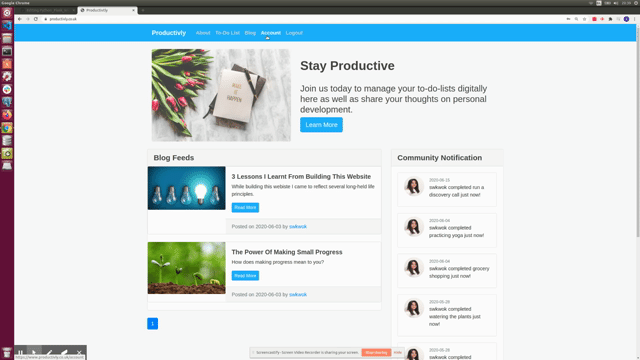

## Productivly 

#### [Productivly](https://productivly.co.uk) enables visitors to create an account to manage To-Do-Lists as well as write posts about personal development. The frontend uses HTML and CSS while the backend uses Python. An SQL database stores all the site's content. The cloud infrastructure used to deploy the web application is a Linode / Ubuntu private server.Please click [here](https://productivly.co.uk/about) to watch a video to walk through the website 

## Key Features 

#### Account Management 

1.Register/Login

2. Update Account Details

#### To-do-List 

1. Create/Update/Delete A Task

2. Complete A Task

#### Personal Blog

1. Create/Update/Delete A Post

## Languages/libraries

- HTML
- CSS
- bootstrap 
- python3.8
- bcrypt7                   
- blinke
- cffi
- click
- dnspython
- email-validator
- Flask
- Flask-Bcrypt
- Flask-Login
- Flask-Mail
- Flask-SQLAlchemy
- Flask-WTF
- idna
- itsdangerous
- Jinja2
- MarkupSafe
- Pillow
- pycparser
- six
- SQLAlchemy
- Werkzeug
- wtforms-html5

